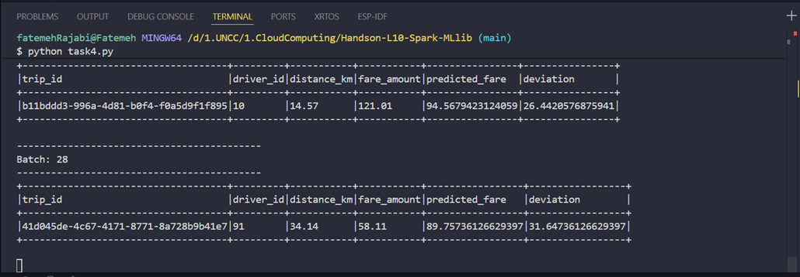
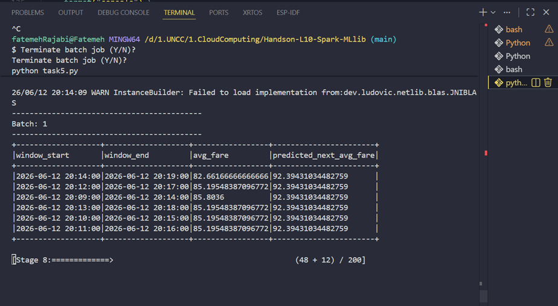

# Handson-L10-Spark-Streaming-MachineLearning-MLlib

# Spark Structured Streaming + MLlib

## Overview

This project uses Spark Structured Streaming and Spark MLlib to process real-time ride-sharing data and make fare predictions.

## Files

- data_generator.py: streams simulated ride-sharing data to localhost:9999
- task4.py: predicts fare using Linear Regression based on distance_km
- task5.py: predicts time-based average fare trends using 5-minute windows
- training-dataset.csv: static training dataset
- models/: saved MLlib models
- outputs/: screenshots of results

## Task 4: Real-Time Fare Prediction

A Linear Regression model was trained using distance_km as the feature and fare_amount as the label. The streaming data was then parsed from the socket, transformed using VectorAssembler, and passed to the trained model to predict fare. A deviation column was calculated to compare actual and predicted fare.

## Task 5: Time-Based Fare Trend Prediction

The training data was grouped into 5-minute windows and average fare was calculated. Time-based features were created using hour_of_day and minute_of_hour. A Linear Regression model was trained and applied to streaming windowed data to predict the next average fare trend.

